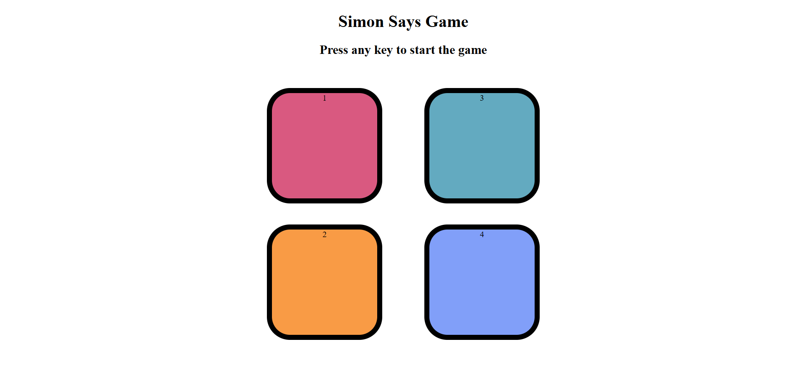

# Simon Says Game - JavaScript Project

This is a simple **Simon Says game clone** built using **HTML, CSS, and JavaScript**. The game generates a sequence of button flashes that the user must replicate in order. With each level, the sequence increases in difficulty.

---

## 🧠 How to Play

- Press any key to start the game.
- Watch the color sequence that flashes.
- Repeat the sequence by clicking the buttons in the correct order.
- The game gets harder with each level.
- If you make a mistake, the game ends and displays your score.

---

## 🚀 Features

- Pure HTML, CSS, and JavaScript (no libraries)
- Sequence-based memory challenge
- Visual button flash and press effects
- Dynamic level progression and score display
- Game over screen with reset functionality

---

## 🛠️ Technologies Used

- HTML5
- CSS3
- JavaScript (ES6)

---

## 📂 Folder Structure

```
/simon-says-game
│
├── index.html
├── style.css
├── app.js
```

---

## 📸 Screenshots



---

## 🌐 Live Demo

[Click here to play the game]()

---

## 🙋‍♀️ Author

**Gauri Patil**  

---

## 📄 License

This project is open source and free to use for learning and educational purposes.
